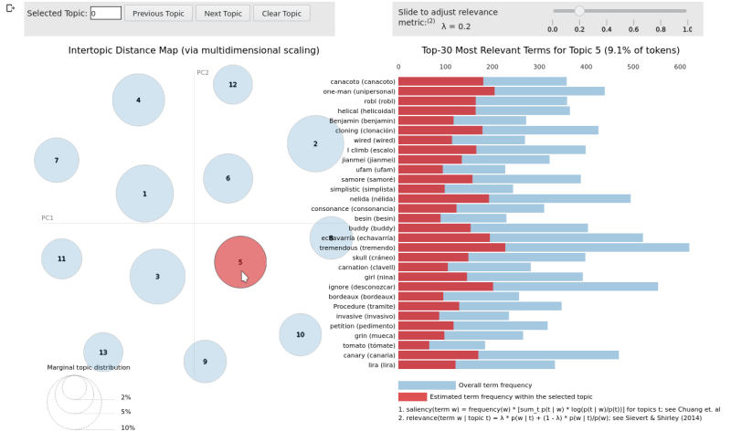

# Unsupervised Thematic Discovery in Non-English Natural Language Corpora

[](https://spacy.io)

## Project Objective

In this exploration, the primary goal is to discover methods for applying modern NLP thematic modeling to generate intuition over non-English language corpora without requiring source document translation. Secondary goals are to discover techniques for hyperparameter optimization and to develop reusable interlingual tools portable across language sources.  Inputs into the processes will be unstructured therefore the design will make few assumptions allowing for flexibility with varied sources and languages.



## Methods

The methods applied to explore the project objective is to stack a series of software tools and provide custom utility functions to accomplish a series of exploration steps. This "toolkit" allows flexibility while exploring latent topics in many natural language  sources.

Once these steps and associated tools are described below, their application will be attempted to determine their efficacy for the project's objective. The intention of describing these tools and methods is to enable further exploration. After an explanation of the tools and demonstrations, ideas for further exploration will be offered based upon the experiences derived from this project. 

## Software Tools

* [spaCy 3.1.2 "Industrial-Strength Natural Language Processing"](https://spacy.io/)
* [Gensim 4.1.2 "Topic modelling for humans"](https://radimrehurek.com/gensim/index.html)
* [pyLDAvis 3.3.1 "Python library for interactive topic model visualization"](https://pyldavis.readthedocs.io/en/latest/readme.html)
* [Google Colab Notebooks](https://colab.research.google.com/)
* [Google Cloud Translation API](https://cloud.google.com/translate/)

**SpaCy** is applied to both parse input text and identify useful features by analyzing the natural language structure within the text. Since this exploration covers multiple language sources, spaCy's many language models which can be interchanged behind its API will be used to allow creation of a single set of text processing functions.

**Gensim** provides topic modeling capabilities and coherence analysis. The outputs from spaCy's preprocessing will be translated into processable "bag-of-words" models then processed using topic modeling algorithms provide by Gensim. Translation integration explained below is worked into Gensim's ```Dictionary``` data structure which is referenced by pyLDAvis explained below.

**pyLDAvis** provides visualizations which easily integrate with Gensim models. These visualizations will be used to explore the created models. These visualizations will also be the view into language translations.

A **Google Colab** notebook is used to contain and execute the source code for this project. Given the processing load is excessive for the resources available to Colab notebooks, it is advised a local Jupyter instance be employed.

**Google Cloud Translation** is used to augment the discovered features through term translation. To run the translations and generate a local repository of cached translation terms, you will need to establish your own Google Cloud account and include your own authentication key in the ```/keys``` folder of the project. There is cost associated with cloud translations which at the time of this writing allowed for 500K chars/month free, $20(USD) per 1M chars/month thereafter. The caching facility built into translations in this project helps manage expense. For a sense of total expense, this project was developed over two billing cycles and total charges were less than $10(USD)

## Steps to Analysis

1. Language-Neutral Processing Pipeline and EDA
1. Coherence Evaluation
1. Translation Integration
1. Model Visualization and Analysis

### 1. Language-Neutral Processing Pipeline and EDA

The text processing pipeline used in this exploration is based around the language models available in spaCy. The processing pipeline is very generic taking advantage of capabilities in spaCy which can be varied by changing out the language model in use.

After processing texts in a stream with the ```pipe()``` method on the given language model, lemmatized tokens are filtered by:

+ Parts-of-Speech
+ Language-Specific Stop words
+ Alphabetic-only Tokens
+ Lemma Within a Length Range

A general EDA function computes various useful statistics over the text input. The EDA independently processes using its own language model pipeline as it takes measure of the entire corpora versus the subset used by processing.

See the Google Colab notebook subsection "Language-Neutral Processing Pipeline" for processing functions. A function is available using Gensim's simple parser for comparison purposes.

See the Google Colab notebook subsection "Text Exploratory Data Analysis (EDA)" for the EDA function.

### 2. Coherence Evaluation

For model evaluation, a configurable evaluation function is provided which builds models asynchronously to take advantage of available processor cores. Coherence measures are gathered and plotted for the requested series of test variable values. The optimal model is returned with the value of the tested variable.

### 3. Translation Integration

#### Translation Caching

Because there are costs associated with the translation API, when features are translated they are persisted in a JSON cache file. This file contains dictionaries for each language pair. Each dictionary contains individual terms previously translated. If the project notebook is being executed in an ephemeral environment such as Google Colab, remember to download a permanent copy of the files persisted in the ```\caches``` folder.

### 4. Model Visualization and Analysis

### Other Tools

# Demonstrations

## Language Samples

1. **French:** ABU la Bibliothèque Universelle 
	* [7 works in French by Jules Verne](http://abu.cnam.fr/BIB/) 
1. **Spanish:** Corpora Collection Leipzig University
	* [30K 2019 Spanish RSS News Samples](https://wortschatz.uni-leipzig.de/en/download/Spanish#spa-ar_web_2019)
1. **Polish/English Parallel:** European Parliament Proceedings Parallel Corpus 1996-2011
	* [Parallel Corpus Polish-English 01/2007-11/2011](http://www.statmt.org/europarl/)

### French Language Sample Analysis


*From the Earth to the Moon* [Public Domain]( https://commons.wikimedia.org/w/index.php?curid=11412182)

This sample consists of seven works by the French author Jules Verne. These are the works listed in length order (longest to shortest) and linked to their Wikipedia plot summaries:
	
+ [Five Weeks in a Balloon](https://en.wikipedia.org/wiki/Five_Weeks_in_a_Balloon#Plot_summary)
+ [Around the World in Eighty Days](https://en.wikipedia.org/wiki/Around_the_World_in_Eighty_Days#Plot)
+ [Robur the Conqueror](https://en.wikipedia.org/wiki/Robur_the_Conqueror#Plot_summary)
+ [From the Earth to the Moon](https://en.wikipedia.org/wiki/From_the_Earth_to_the_Moon#Plot)
+ [The Begum's Fortune](https://en.wikipedia.org/wiki/The_Begum%27s_Fortune#Plot_summary)
+ [The Blockade Runners](https://en.wikipedia.org/wiki/The_Blockade_Runners#Plot_introduction)
+ [The Mutineers of the Bounty](https://en.wikipedia.org/wiki/The_Mutineers_of_the_Bounty)

### Spanish Language Sample Analysis

<div class="getty embed image" style="background-color:#fff;display:inline-block;font-family:Roboto,sans-serif;color:#a7a7a7;font-size:11px;width:100%;max-width:498px;"><div style="padding:0;margin:0;text-align:left;"><a href="http://www.gettyimages.com/detail/458680657" target="_blank" style="color:#a7a7a7;text-decoration:none;font-weight:normal !important;border:none;display:inline-block;">Embed from Getty Images</a></div><div style="overflow:hidden;position:relative;height:0;padding:69.27711% 0 0 0;width:100%;"><iframe src="//embed.gettyimages.com/embed?assets=458680657,512034480,531627279&et=EKKwPsLISGlVwi1VcyRXBg&tld=com&sig=F5z7w7TrVv1nuYv_mBpfxr_cnpAN-mmDtf7rGiiNoeA=&caption=false&ver=1" scrolling="no" frameborder="0" width="498" height="345" style="display:inline-block;position:absolute;top:0;left:0;width:100%;height:100%;margin:0;"></iframe></div></div>

### English-Polish Parallel Language Sample Analysis

## Ideas for Further Exploration

[Project References](https://github.com/jbrown544/interlingual-topic-modeling/blob/main/REFERENCES.md)

Authored with [ghostwriter](https://wereturtle.github.io/ghostwriter/index.html)
