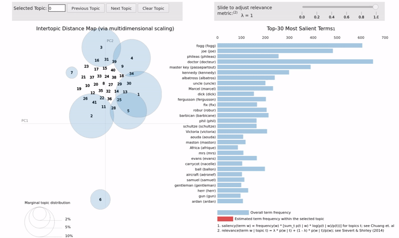

# Unsupervised Thematic Discovery in Non-English Natural Language Corpora

[](https://spacy.io)

## Objective

In this exploration, the primary goal is to discover methods for applying modern NLP thematic modeling to generate intuition over non-English language corpora without requiring source document translation. Secondary goals are to discover techniques for parameter optimization and to develop reusable interlingual tools portable across language sources.  Inputs into the processes will be unstructured therefore the design will make few assumptions allowing for flexibility with varied sources and languages.


## Methods and Tooling

The method applied to explore the project objective is to stack a series of software tools embellished with custom utility functions to accomplish a series of preparation and analysis steps. This "toolkit" approach allows flexibility for exploring latent topics across many natural language sources.

After describing these steps and associated tools below, their application will be demonstrated to determine their efficacy for this project's objective. The intention of describing the tools and methods is to enable further exploration beyond the demonstrations given. After the explanation of these tools and their demonstration, ideas for further exploration will be offered based upon the experiences of this project. 

The Python project notebook implementing these steps and tools is contained in this repository as [Interlingual\_Topic\_Modeling.ipynb](./Interlingual_Topic_Modeling.ipynb).

## Software Tools

* [spaCy 3.1.3 "Industrial-Strength Natural Language Processing"](https://spacy.io/)
* [Gensim 4.1.2 "Topic modelling for humans"](https://radimrehurek.com/gensim/index.html)
* [pyLDAvis 3.3.1 "Python library for interactive topic model visualization"](https://pyldavis.readthedocs.io/en/latest/readme.html)
* [Google Cloud Translation API](https://cloud.google.com/translate/)
* [Google Colab Notebooks](https://colab.research.google.com/)

**spaCy** is applied to both parse input text and identify useful features by analyzing the natural language structure within the text. Since this exploration covers multiple language sources, spaCy's many language models which can be interchanged behind its API will be used to allow creation of a single set of text processing functions.

**Gensim** provides topic modeling capabilities and coherence analysis. The outputs from spaCy's preprocessing will be translated into processable "bag-of-words" models then processed using topic modeling algorithms provide by Gensim. Translation integration explained below is worked into Gensim's ```Dictionary``` data structure which is referenced by pyLDAvis explained below.

**pyLDAvis** provides visualizations which easily integrate with Gensim models. These visualizations will be used to explore the created models. These visualizations will also be the view into language translations.

A **Google Colab** [project notebook](./Interlingual_Topic_Modeling.ipynb) is used to contain and execute the source code for this project. Given this processing load is excessive for the resources made available to Colab, it is advisable to connect Colab to a [local Jupyter instance](https://research.google.com/colaboratory/local-runtimes.html) or execute the notebook on a suitably powerful workstation in Jupyter.

Be sure to take advantage of the "Table of contents" navigation available within the Google Colab [project notebook](./Interlingual_Topic_Modeling.ipynb). You will find various utility functions in the beginning portion followed by three demonstrations with text in several languages. The demonstrations are organized in similar hierarchies to allow sections to be easily located.


**Google Cloud Translation** is used to augment the discovered features through term translation. To run the translations and generate a local repository of cached translation terms, **you will need to establish your own Google Cloud account and include your own authentication key in the ```/keys``` folder of the project**. There is cost associated with cloud translations which at the time of this writing allowed for 500K chars/month free then $20(USD) per 1M chars/month thereafter. A caching facility built into translations for this project helps manage expense if you retain copies of the cache file ```xlat.json```. For an idea of potential expense, this project was developed over two billing cycles (1M free chars) and overage charges were less than $10(USD)

## Analysis Steps

Here are the overall steps applied in processing each language for high level context:

1. Language-Neutral Processing Pipeline and EDA
1. Modeling
1. Coherence Evaluation
1. Translation Integration
1. Visualization and Analysis

Each step will be elaborated below.

### 1. Language-Neutral Processing Pipeline and EDA

The text processing pipeline used in this exploration is based around the language models available in spaCy. The processing pipeline is very generic taking advantage of capabilities in spaCy which can be varied by changing out the language model in use.

After processing texts in a stream with the ```pipe()``` method on the given language model, lemmatized tokens are filtered by:

+ Parts-of-Speech
+ Language-Specific Stop words
+ Alphabetic-only Tokens
+ Lemma Within a Length Range

A general EDA function computes various useful statistics over the text input. The statistics provided were loosely based upon a demonstration of the general EDA capabilities of the tool Splunk. The EDA independently processes using its own language model pipeline as it takes measure of the entire corpora versus the subset used by processing.

See the Google Colab [project notebook](./Interlingual_Topic_Modeling.ipynb) subsection "Language-Neutral Processing Pipeline" for processing functions. A function is available using Gensim's simple parser for comparison purposes.

See the Google Colab [project notebook](./Interlingual_Topic_Modeling.ipynb) subsection "Text Exploratory Data Analysis (EDA)" for the EDA function.

### 2. Modeling

In this pipeline, modeling and coherence evaluation have been integrated. In the following coherence evaluation step, the model showing the most promise is produced for continued processing. If the evaluation step does not produce the desired model, an additional coherence evaluation step is sometimes introduce which only evaluates a single value of a test variable. This ensures the single evaluated model is guaranteed to be the one output for further processing.

The evaluations performed focus on the LDA and HDP models available in Gensim. Both models decompose documents into sets of topics which are themselves distributions over the vocabularies contained in the documents. LDA is a familiar modeling technique but requires the number of topics be specified and that the corpus be fully processed. HDP provides similar capabilities, but can infer the number of topics from the text. HDP may still be tuned within given parameters and will be compared to the more familiar LDA with the chosen data sets.

### 3. Coherence Evaluation

For model evaluation, a configurable evaluation function is provided which builds test models asynchronously to take advantage of available processor cores. Coherence measures are gathered and plotted for the requested series of test variable values. The optimal model is returned with the value of the tested variable.

This configurable function can be customized to either review a model directly or to review topics taken from the model for cases where the Gensim coherence model capabilities do not yet support a particular model class. In this demonstration, an HDP model is used which is not documented as yet supported by Gensim coherence modeling, but both approaches yield equivalent results in informal trials.

Additionally, a sorting key function can be configured to select the optimal model based upon criteria. Functions for finding lowest values and those nearest one are included for use with the demonstrated coherence metrics.

### 4. Translation Integration

Translations are integrated for visualization by creating an alternate Gensim dictionary provided to pyLDAvis. This translated dictionary is created by persisting the Gensim generated dictionary to a file, augmenting the terms in the file with the requested language translation, then reconstituting an instance of the augmented dictionary. This augmented dictionary may then be used in pyLDAvis to present both the target and source language terms.

#### Note: Caching

Because there are costs associated with the cloud translation API, as features are translated they are persisted in a JSON cache file. This file contains dictionaries for each language pair developed. Each language pair dictionary contains individual terms previously translated (source vs. target language). If the [project notebook](./Interlingual_Topic_Modeling.ipynb) is being executed in an ephemeral environment (such as Google Colab), remember to download a permanent copy of the cache files in the ```\caches``` folder. Generating the same translations repeatedly using the cloud API can become unnecessarily expensive otherwise.

### 5. Visualization and Analysis

Models are depicted using pyLDAvis dimensional reductions. This allows models usually exist with dimensional impossible to conceptualize to be be viewed on screen. These may be viewed by opening the [project notebook](./Interlingual_Topic_Modeling.ipynb) in either Google Colab or the nbviewer link accessible from with GitHub. The GitHub code viewer does show cell outputs, but does not show these visualizations which will appear as a blank output cell. [Here](https://www.youtube.com/watch?v=IksL96ls4o0) is an excellent video which helps explain the operation of pyLDAvis. It demonstrates an older version of the tool, but provides insight into how latent topics may be analyzed in a model.

# Demonstrations

## Language Samples

1. **French:** ABU la Bibliothèque Universelle 
	* source: [7 works in French by Jules Verne](http://abu.cnam.fr/BIB/)
	* project copies: [/text/books/fr/](./text/books/fr)
1. **Spanish:** Corpora Collection Leipzig University
	* source: [30K 2019 Spanish RSS News Samples](https://wortschatz.uni-leipzig.de/en/download/Spanish#spa-ar_web_2019)
	* project copies: [/text/news/es/](./text/news/es)
1. **Polish/English Parallel:** European Parliament Proceedings Parallel Corpus 1996-2011
	* source: [Parallel Corpus Polish-English 01/2007-11/2011](http://www.statmt.org/europarl/)
	* project copies: [/text/gov/multi/](./text/gov/multi)

## French Language Sample Analysis

This sample consists of seven works by the French author Jules Verne.

<figure>

<figcaption>Henri de Montaut, <a href="https://commons.wikimedia.org/w/index.php?curid=11412182">Public Domain</a>, via Wikimedia Commons</figcaption>
</figure>

These are the works listed in length order (longest to shortest) and linked to their Wikipedia plot summaries:
	
+ [Five Weeks in a Balloon](https://en.wikipedia.org/wiki/Five_Weeks_in_a_Balloon#Plot_summary)
+ [Around the World in Eighty Days](https://en.wikipedia.org/wiki/Around_the_World_in_Eighty_Days#Plot)
+ [Robur the Conqueror](https://en.wikipedia.org/wiki/Robur_the_Conqueror#Plot_summary)
+ [From the Earth to the Moon](https://en.wikipedia.org/wiki/From_the_Earth_to_the_Moon#Plot)
+ [The Begum's Fortune](https://en.wikipedia.org/wiki/The_Begum%27s_Fortune#Plot_summary)
+ [The Blockade Runners](https://en.wikipedia.org/wiki/The_Blockade_Runners#Plot_introduction)
+ [The Mutineers of the Bounty](https://en.wikipedia.org/wiki/The_Mutineers_of_the_Bounty)

Building these seven works into our corpus and performing exploratory text analysis on their combined content, we can see there are over 25K unique words (alphabetic tokens) taken from over 335K words. There are around the same number of sentences as unique words.

We can see these works average about 13 words per sentence. The document averages are influenced by the two shortest works  being notably shorter than the others, but having that contrast could be helpful.

### Exploratory Data Analysis

---

| Measure | # |
|:--|--:|
| Documents | 7 |
| Parts-of-Speech | 17 |
| Sentences | 25,795 |
| Tokens | 441,016 |
| Words | 335,790 |
| Unique Words | 25,396 |

---

|Statistic | # |
|:--|--:|
| Avg. Tokens/Sentence | 17.1 |
| Avg. Words/Sentence | 13.02 |
| Avg. Tokens/Document | 63,002.29 |
| Avg. Words/Document | 47,970.0 |
| Avg. Sentences/Document | 3,685.0 |

---

In the 17 parts-of-speech detected, there are notable occurrences of adpositions, nouns, and verbs.

[POS Tags](https://universaldependencies.org/docs/u/pos/)


The most common nouns detected often describe the fictional characters, time, measurement, or places. These works are often about travel with science fiction themes relevant to the time they were written. Interestingly, though the parts-of-speech plot indicated far more nouns than proper nouns, here we see several what appear to be proper nouns in the most common plot. 


The most common verbs detected in these fictional works indicate significant conversation and activity.


### Parameter Estimation

When performing evaluations seeking a meaningful number of topics to model in this corpus, there appeared to be a knee developing around 40 when using the T topic cutoff for an HDP model. 

For more on the process of estimating a good value for this parameter, see the [project notebook](./Interlingual_Topic_Modeling.ipynb).


### Model Visualization

In this animation of our topic model visualization, it appears the seven works included have themselves become the most prevalent topics. Each of the large bubbles top terms match characters, places, and things explained in the plot summaries linked earlier. Of particular interest is bubble 6 which lies outside the cluster of the other works. This work appears to be    the second to smallest work about blockade runners during the American Civil War which is possibly more historical than some of the other fictional accounts. Also note, the topical bubble sizes mostly correlate with the size of their respective works. Lastly, note that the six works that form a cluster surround many far smaller topics whose centrality may indicate those topics are thematically bounded by the ideas present in the works themselves. 

Opening the [project notebook](./Interlingual_Topic_Modeling.ipynb) allows interaction with this visualization for exploration of the topics. Be sure to use the "Open in Colab" button at top to enable the visualizations because the GitHub 
source viewer does not display them. Also, remember to expand the left "Table of contents" panel to quickly navigate the notebook's structure.



## Spanish Language Sample Analysis

This sample contains 30K Spanish news headlines gathered from such sources as RSS feeds.

<figure>

<figcaption>Melbeans, <a href="https://commons.wikimedia.org/wiki/File:109899_newsstand_300.jpg">Public Domain</a>, via Wikimedia Commons</figcaptiion>
</figure>

### Exploratory Data Analysis

Treating these headlines as individual documents and performing exploratory text analysis, we can see there are almost 2 sentences per headline with an average of just over 11 words (alphabetic tokens) per sentence. This gives us the just over 22 average words per document.

---

| Measure | # |
|:--|--:|
| Documents | 30,000 |
| Parts-of-Speech | 16 |
| Sentences | 58,768 |
| Tokens | 860,668 |
| Words | 669,628 |
| Unique Words | 54,132 |

---

|Statistic | # |
|:--|--:|
| Avg. Tokens/Sentence | 14.65 |
| Avg. Words/Sentence | 11.39 |
| Avg. Tokens/Document | 28.69 |
| Avg. Words/Document | 22.32 |
| Avg. Sentences/Document | 1.96 |

---

In the 16 parts-of-speech detected, there are notable occurrences of adpositions, determiners, nouns, and verbs. The ratio of proper nouns to nouns appears be higher than in the earlier lengthy fictional works, but information-packed news headlines may explain this.

[POS Tags](https://universaldependencies.org/docs/u/pos/)


The most common nouns in this Spanish news headline sample reflect many mentions of time, place, and terms that may be affiliated with governance.


The most common verbs in these news headlines involve actions associated with reporting (said, watch, he pointed, assured, reported, explained, find, added, He says). There are are also various words that appear to be variations of "have."


### Parameter Estimation

When performing evaluations seeking a meaningful number of topics to model in this corpus, coherence diminished as topics were added for an HDP model. There appeared to be a plateau beginning around the 20 topic point while still reflecting a good coherence score. A value of T=22 was modeled for the visualization.

For more on the process of estimating a good value for this parameter, see the [project notebook](./Interlingual_Topic_Modeling.ipynb).


### Model Visualization

In this animation of our topic model visualization, we can see the 22 topics modeled disperse evenly and appear to be relatively proportional in size. With tens of thousands of headlines reduced to 22 topics, these topics are likely to include concepts that may appear quite unrelated in human interpretation. For example, adjusting the relevance slider to 0.5 for an even mix of term frequency and term relevance, we can observe terms in topic 8 including thunberg (Greta Thunberg?), greenpeace, censorship, newspapers, Francoism, and pinochet (Augusto Pinochet?). Exploring the topics in this corpora is not as simple as the earlier French example, but developing themes can be perceived within these topics.

Opening the [project notebook](./Interlingual_Topic_Modeling.ipynb) allows interaction with this visualization for exploration of the topics. Be sure to use the "Open in Colab" button at top to enable the visualizations because the GitHub 
source viewer does not display them. Also, remember to expand the left "Table of contents" panel to quickly navigate the notebook's structure.


## English-Polish Parallel Language Sample Analysis

<figure>

<figcaption>Michielverbeek, <a href="https://creativecommons.org/licenses/by-sa/4.0">CC BY-SA 4.0</a>, via Wikimedia Commons</figcaption>
</figure>

### Exploratory Data Analysis

---

| Measure | English# | Polish# |
|:--|--:|--:|
| Documents | 150,000 | 150,000 |
| Parts-of-Speech | 15 | 17 |
| Sentences | 200,287 | 304,388 |
| Tokens | 4,119,913 | 3,581,908 |
| Words | 3,509,689 | 2,928,209 |
| Unique Words | 34,083 | 102,810 |

---

|Statistic | English# | Polish# |
|:--|--:|--:|
| Avg. Tokens/Sentence | 20.57 | 11.77 |
| Avg. Words/Sentence | 17.52 | 9.62 |
| Avg. Tokens/Document | 27.47 | 23.88 |
| Avg. Words/Document | 23.4 | 19.52 |
| Avg. Sentences/Document | 1.34 | 2.03 |

---

[POS Tags](https://universaldependencies.org/docs/u/pos/)

| English | Polish |
|:-:|:-:|
|  |  |
|  | 
|  | 

## Ideas for Further Exploration

1. An interesting idea for additional exploration is to retrofit the processing pipeline introduced here with the library [tomotopy](https://bab2min.github.io/tomotopy/v0.12.2/en/). According to this [post by Eduardo Coronado Sroka](https://towardsdatascience.com/dont-be-afraid-of-nonparametric-topic-models-part-2-python-e5666db347a), Gensim can be difficult when using HDP and there may be advantages with tomotopy. Initial investigation indicated there [may be code](https://github.com/bab2min/tomotopy/blob/main/examples/lda_visualization.py) to help visualize tomotopy output using pyLDAvis.
2. The JSON cache file currently persisting term translations could be modified to use a shared repository of translations such as a database service. Maintaining the information in a file is not always convenient. Interrogating cloud APIs for the translation of individual terms can become expensive.
3. The parallel language sample used in this exploration did not generate ideal topic coherence. Investigating other translations such as public domain books may prove interesting for comparing topic models generated in works with equivalent meaning.
4. Performing machine pre-translations on texts then applying the process developed here for comparing parallel corpora also offers interesting territory for exploration. This is especially the case to detect if the machine translation product introduces entropy potentially reducing coherence.

## More Information

[Project References](./REFERENCES.md)

Authored with [ghostwriter](https://wereturtle.github.io/ghostwriter/index.html)
